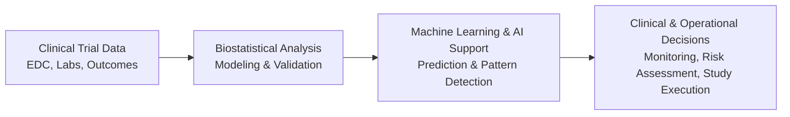

Biomedical Analytics & Clinical Operations

Focused on entry-level biostatistics and clinical research roles supporting data-driven clinical trial execution and analysis.

Portfolio demonstrating applied biostatistical analysis, clinical trial analytics, and responsible use of machine learning and AI in regulated biomedical research environments. Projects demonstrate statistical modeling, clinical operations workflows, and responsible use of AI for clinical research and decision support.

Quick Navigation

-  [Clinical Analytics Workflow](#clinical-analytics-workflow)
-  [Clinical Analytics Projects](#clinical-analytics-projects)
-  [Methods Library](#methods-library)
-  [Clinical Context](#clinical-context)
-  [Tools & Technologies](#tools--technologies)
-  [About](#about)

# Clinical Analytics Workflow

# Analytical Principles

Work in this portfolio follows core biostatistical and clinical research principles:

- Statistical validity and reproducibility prioritized over model complexity
- Clinical interpretability emphasized in model selection and evaluation
- AI and machine learning used as decision-support tools, not replacements for statistical reasoning
- Analytical methods aligned with clinical trial workflows and regulatory expectations
- Transparent documentation and reproducible analysis pipelines

## Areas of Work

# Clinical Analytics Projects

Applied work demonstrating statistical and operational problem-solving in clinical research.

- Clinical Trials Operations System
- Clinical Outcome Prediction (in progress)
- AI-Assisted Clinical Risk Monitoring (planned)
- Clinical NLP Tools (planned)

# Methods Library

Reusable analytical methods supporting project work.

- Survival analysis workflows
- Model validation & calibration
- Missing data approaches
- Reproducible analysis templates

# Clinical Context

Short technical notes connecting analytics to trial execution.

- Risk-based monitoring concepts
- Clinical data workflows
- AI considerations in regulated research

# Tools & Technologies
- Python (pandas, scikit-learn)
- R (survival, tidyverse)
- Quarto
- JupyterLab
- Git & GitHub
- Statistical Modeling & Machine Learning

# About

Biomedical sciences and biostatistics-focused professional with academic training in clinical research and project management experience. Portfolio emphasizes practical application of statistical and AI methods within clinical trial environments.

# Related Project

Clinical Trials Operations System (live binder):
https://gminor71.github.io/clinical-trials-operations-system/