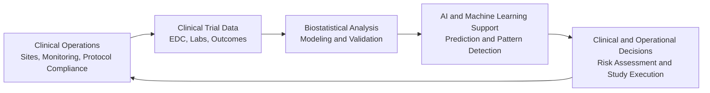

# Biomedical Analytics and Clinical Operations

Integrated portfolio demonstrating clinical research operations, biostatistics, 
and analytics workflows across the clinical trial lifecycle.
Focused on entry-level clinical research operations (CRA pathway) and 
biostatistics roles supporting data-driven clinical trial execution and analysis.

Quick Navigation

-  [Clinical Analytics Workflow](#clinical-analytics-workflow)
-  [Clinical Operations and Analytics Projects](#clinical-operations-and-analytics-projects)
-  [Methods Library](#methods-library)
-  [Clinical Context](#clinical-context)
-  [Tools and Technologies](#tools-and-technologies)
-  [About](#about)

## Program Narrative

This repository is structured as an integrated clinical research learning
program that follows the lifecycle of modern clinical trials — 
from operational execution to statistical analysis and advanced analytics.

The program begins with clinical operations frameworks and CRA-oriented 
simulations that model how studies are executed at the site and project level. 
These activities generate the clinical data foundation that supports downstream 
biostatistical analysis, reproducible reporting, and analytical decision-making.

Clinical trial statistical analysis projects demonstrate how operationally 
generated data is transformed into evidence through structured workflows, 
Tables/Figures/Listings (TFLs), and validated analytical methods. 
Advanced analytics and AI projects extend this work by exploring how 
machine learning can responsibly support — but not replace — statistical 
reasoning and clinical decision-making.

Together, these components represent a systems-level approach to clinical 
research where operations, data quality, biostatistics, and analytics are 
treated as interconnected parts of a single clinical development process.

## Program Structure

The repository is organized as a modular clinical research program where 
each component represents a stage in the clinical trial lifecycle.

biomedical-analytics-clinical-operations/
│
├── clinical-trials-operations-system
│   Operational handbook and reference framework for clinical trial execution
│
├── projects
│   ├── clinical-operations-simulations
│   │   CRA monitoring simulations and operational scenario exercises
│   │
│   └── clinical-trial-statistical-analysis
│       Reproducible clinical trial statistical workflows and TFL reporting
│
├── methods-library
│   Reusable statistical methods and project templates
│
└── resources
    Program-level documentation standards and references

### Program Orientation

* **[Clinical Trials Operations System](clinical-trials-operations-system)**  
  Operational handbook and reference framework for clinical trial execution.

* **[Clinical Operations Simulations](projects/clinical-operations-simulations)**  
  CRA-focused monitoring simulations modeling realistic site oversight and operational workflows.

* **[Clinical Trial Statistical Analysis (CT Projects)](projects/clinical-trial-statistical-analysis)**  
  Reproducible biostatistical analysis workflows including TFL generation and clinical reporting.

* **AI and Advanced Analytics Projects** *(in development)*  
  Exploration of responsible machine learning approaches supporting clinical research decision-making.

Together these components model the full clinical research lifecycle:
**operations → data generation → statistical analysis → analytical decision support**.

# Program map

```mermaid
flowchart LR
    A[Clinical Trials Operations System<br/>Handbook and Operational Reference]
      --> B[Clinical Operations Simulations<br/>CRA Training and Execution Practice]
      --> C[Clinical Trial Statistical Analysis (CT Projects)<br/>Biostatistical Workflows and TFL Reporting]
      --> D[AI and Advanced Analytics Projects<br/>Decision Support and Predictive Modeling]
```

# Clinical Analytics Workflow

```mermaid
flowchart LR
    A[Clinical Operations<br/>Sites, Monitoring, Protocol Compliance]
      --> B[Clinical Trial Data<br/>EDC, Labs, Outcomes]
      --> C[Biostatistical Analysis<br/>Modeling and Validation]
      --> D[AI and Machine Learning Support<br/>Prediction and Pattern Detection]
      --> E[Clinical and Operational Decisions<br/>Risk Assessment and Study Execution]

    E --> A
```

# Analytical Principles

Work in this portfolio follows core biostatistical and clinical research principles:

- Statistical validity and reproducibility prioritized over model complexity
- Clinical interpretability emphasized in model selection and evaluation
- AI and machine learning used as decision-support tools, not replacements 
for statistical reasoning
- Analytical methods aligned with clinical trial workflows and 
regulatory expectations
- Transparent documentation and reproducible analysis pipelines

## Areas of Work

## Clinical Operations and Analytics Projects

### Clinical Trials Operations System
Documentation-driven clinical trial operations framework demonstrating study 
organization, site management structure, and operational workflows 
aligned with clinical research execution.

### Clinical Operations Simulations
Scenario-based CRA monitoring simulations modeling realistic trial environments
including site oversight, query management, and risk-based monitoring.

### Clinical Trial Statistical Analysis
Structured clinical trial analysis workflows demonstrating reproducible
statistical modeling, Tables/Figures/Listings (TFL) generation,
and clinical reporting.

### Clinical Outcome Prediction *(in progress)*
Exploration of predictive modeling approaches for clinical outcomes using 
trial-derived datasets.

### AI-Assisted Clinical Risk Monitoring *(planned)*
Investigation of machine learning approaches to support risk-based monitoring 
and site performance assessment.

### Clinical NLP Tools *(planned)*
Exploration of natural language processing approaches for clinical documentation
and research data extraction.

# Methods Library

### Survival Analysis Workflows
Reusable implementations of time-to-event analysis methods commonly used in clinical trials.

### Model Validation and Calibration
Methods supporting evaluation of predictive models in biomedical datasets.

### Missing Data Approaches
Strategies for handling incomplete clinical data within reproducible analysis pipelines.

# Clinical Context

Short technical notes connecting analytics to trial execution.

- Risk-based monitoring concepts
- Clinical data workflows
- AI considerations in regulated research

# Tools and Technologies
- Python (pandas, scikit-learn)
- R (survival, tidyverse)
- Quarto
- JupyterLab
- Git & GitHub
- Statistical Modeling & Machine Learning

# About

Biomedical sciences and biostatistics-focused professional with academic training 
in clinical research and project management experience. 
Portfolio emphasizes practical application of statistical and 
AI methods within clinical trial environments.
Current focus is building practical clinical research associate (CRA) 
competencies alongside biostatistical analysis skills. 

# Related Project

Clinical Trials Operations System (live binder):
https://gminor71.github.io/clinical-trials-operations-system/