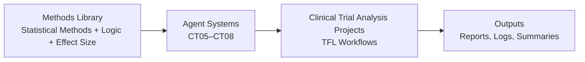

# System Architecture – Biomedical Analytics & Clinical Operations

## Overview

This repository is designed as a structured clinical research system that integrates:

- Clinical operations workflows
- Biostatistical analysis pipelines
- Agent-based decision systems
- Reusable statistical knowledge (methods library)

The architecture separates **what to do**, **how to decide**, and **how to execute**.

---

## Core Architecture

The system is organized into three primary layers:

```text
Layer 1: Methods Library        → Statistical knowledge and decision logic
Layer 2: Agent Systems         → Structured, executable decision frameworks
Layer 3: Analysis Projects     → Reproducible statistical workflows
```
---

## System Diagram



### Component Breakdown

## Methods Library (Knowledge Layer)

Location:

methods-library/

Provides:

- Statistical method references
- Agent logic frameworks
- Time-to-event
- Binary
- Continuous
- SAP outline planning
- Effect size guidance
- Project templates and documentation standards

Role:
Defines how statistical decisions should be made and interpreted.

## Agent Systems (Decision Layer)

Location:

projects/clinical-trial-statistical-analysis/clinical-trials/projects/

Includes:

- ct05_tte_methods_agent
- ct06_sap_outline_agent
- ct07_binary_methods_agent
- ct08_continuous_endpoints_agent

Function:

- Convert statistical knowledge into structured logic
- Accept YAML-based inputs

Produce:
- Method recommendations
- SAP components
- Warnings and assumptions
- Structured reports and logs

Role:
Standardize and automate statistical decision-making.

## Analysis Projects (Execution Layer)

Includes:

- Traditional endpoint analyses (binary, TTE, longitudinal)
- TFL (Tables, Figures, Listings) generation
- Reproducible workflows in R and Python

Role:
Execute statistical analyses using validated methods and structured workflows.

## Data Flow

Structured Input (YAML)
        ↓
Agent Processing (Decision Logic)
        ↓
Decision Output (Method + Assumptions + Notes)
        ↓
Reports (Markdown) + Logs (JSON)
        ↓
Batch Summary (Cross-case analysis)

## Design Principles

This system is built on the following principles:

- Deterministic first
- Rule-based, explainable statistical logic
- Modular architecture
- Separation of inputs, logic, orchestration, and reporting
- Auditable outputs
- Markdown reports and structured logs for traceability
- Separation of concerns
- Methods library = knowledge
- Agents = decisions
- Projects = execution
- Scalable design
- Supports future AI-assisted and agentic extensions

## Relationship to Clinical Research Workflow

This architecture reflects the clinical trial lifecycle:

Clinical Operations → Data Generation → Statistical Analysis → Decision Support

- Operations define how data is generated
- Analysis transforms data into evidence
- Agents standardize statistical decision-making
- Methods library ensures consistency and interpretability

## Key Principle

> Statistical analysis should be reproducible, and statistical reasoning 
should be structured, transparent, and scalable.
