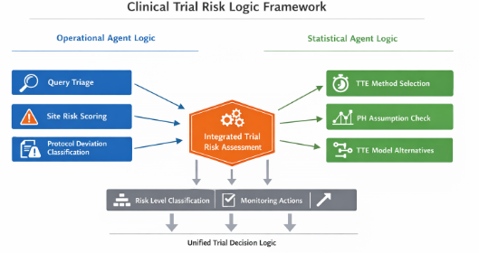

# Agent Logic – INDEX

## Overview

The **Agent Logic** module defines structured, decision-based workflows 
that translate clinical research operations and biostatistical methods 
into **actionable, machine-readable logic**.

This layer represents the transition from:

* Static reference materials
  → to
* **Executable decision frameworks** supporting agentic AI systems

Agent logic is designed to support:

* Clinical trial operations (CRA workflows, monitoring, query management)
* Biostatistical method selection and validation
* Risk-based decision-making across the trial lifecycle





---

## Purpose

This module provides:

* Standardized **decision logic templates**
* Rule-based and hybrid (rule + AI) frameworks
* Clear mapping between:

  * Inputs (data)
  * Rules (logic)
  * Outputs (actions)

The goal is to enable:

* Consistent decision-making
* Automation readiness
* Traceability and auditability

---

## Core Concepts

### 1. Agent Loop

All agent logic follows a consistent structure:

**Observe → Evaluate → Decide → Act → Reassess**

* **Observe**: ingest data (queries, visits, endpoints)
* **Evaluate**: apply rules or statistical checks
* **Decide**: classify issue or select method
* **Act**: generate outputs (queries, actions, recommendations)
* **Reassess**: determine if follow-up or escalation is required

---

### 2. Logic Types

#### Rule-Based Logic

* Deterministic
* Threshold-driven
* Fully auditable

Examples:

* Query age > 14 days → overdue
* Missing lab > 7 days → flag

#### Reasoning-Based Logic (LLM-supported)

* Context-aware
* Used for interpretation and narrative generation

Examples:

* Draft monitoring summaries
* Interpret model outputs

#### Hybrid Model (Recommended)

* Rules → detection and classification
* AI → explanation and drafting
* Human → validation and approval

---

### 3. Inputs, Rules, Outputs

Each agent logic file follows a standard structure:

* **Inputs**

  * Data sources (query logs, protocol, datasets)

* **Trigger Conditions**

  * Events or thresholds that initiate evaluation

* **Decision Rules**

  * Structured logic for classification or selection

* **Outputs**

  * Actions (queries, logs, recommendations)

* **Escalation Criteria**

  * Conditions requiring higher-level review

* **Human Review**

  * Required validation checkpoints

---

### 4. Human-in-the-Loop Requirement

All agent logic assumes:

* Final decisions remain with:

  * CRA
  * Data manager
  * Biostatistician
* Outputs are **recommendations**, not autonomous actions

---

### 5. Auditability and Traceability

Agent logic is designed to align with:

* Good Clinical Practice (GCP)
* Regulatory expectations (e.g., 21 CFR Part 11)

Key principles:

* Deterministic rules where possible
* Transparent decision pathways
* Reproducible outputs

---

## Module Structure

```text
agent-logic/
│
├── INDEX.md
├── design_principles.md
│
├── clinical-operations/
│   ├── cra_query_triage.md
│   ├── site_risk_scoring.md
│   └── protocol_deviation_classification.md
│
├── biostatistics/
│   ├── tte_method_logic.md
│   ├── km_interpretation_logic.md
│   └── model_diagnostics_logic.md
│
└── cross-functional/
    └── trial_risk_integration_logic.md
```

---

## Relationship to Methods Library

The Agent Logic module extends the existing **methods-library**:

| Methods Library     | Agent Logic            |
| ------------------- | ---------------------- |
| Conceptual guidance | Decision execution     |
| Statistical methods | Method selection logic |
| Templates           | Action generation      |
| Common pitfalls     | Exception handling     |

This creates a progression:

**Method → Rule → Workflow → Agent**

---

## Initial Components

### Clinical Operations

* CRA Query Triage
* Site Risk Scoring
* Protocol Deviation Classification

### Biostatistics

* Time-to-Event Method Selection Logic
* Kaplan-Meier Interpretation Logic
* Model Diagnostics Logic

### Cross-Functional

* Trial Risk Integration Logic

---

## Future Expansion

Planned additions:

* Multi-agent coordination (CRA + Data Management + Biostatistics)
* Integration with monitoring visit frameworks (MV1 / MV2)
* Automated TFL generation support
* Decision logging and audit trail templates

---

## How to Use This Module

1. Select relevant logic file
2. Identify required inputs
3. Apply decision rules
4. Generate outputs
5. Validate via human review

---

## Strategic Role in Repository

This module represents:

* A bridge between **clinical research expertise and AI systems**
* A foundation for:

  * Automation
  * Decision support tools
  * Agentic clinical trial workflows

---

## Summary

The Agent Logic module transforms:

* Knowledge → structured rules
* Workflows → repeatable systems
* Decisions → traceable logic

Enabling the development of:

> **Scalable, auditable, and intelligent clinical research support systems**
