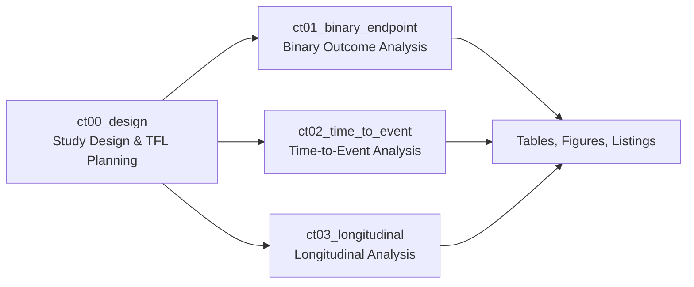

# Clinical Trial Statistical Analysis – Biostatistics Workspace

This repository demonstrates a structured clinical trial statistical analysis workflow using reproducible Tables, Figures, and Listings (TFL) development aligned with common biostatistics practices.

This project is organized by endpoint type to reflect common clinical
trial statistical analysis workflows:

## Analysis Workflow

This workflow reflects common clinical trial analysis practices in which statistical analyses are prespecified during study design and implemented through reproducible Tables, Figures, and Listings (TFL) workflows.

## Study-Level Workflow

This workspace represents a single clinical trial analysis environment
organized by endpoint type. Analyses follow a common workflow:

1. Study design and analysis planning (`ct00_design`)
2. Endpoint-specific statistical analysis
   - Binary endpoints (`ct01_binary_endpoint`)
   - Time-to-event endpoints (`ct02_time_to_event`)
   - Longitudinal endpoints (`ct03_longitudinal`)
3. Generation of reproducible Tables, Figures, and Listings (TFLs)

Each endpoint analysis is implemented independently while adhering to a
shared structure and reporting workflow.

## Structure

- `projects/`
  - Active and completed clinical trial analyses
  - Each project is self-contained and reproducible

- `framework/`
  - Shared R utilities used across projects
  - Includes standardized path helpers and reusable functions

### Endpoint Mapping

- Binary endpoints → logistic regression–based analyses
- Time-to-event endpoints → Kaplan–Meier estimation and Cox proportional hazards modeling
- Longitudinal endpoints → repeated-measures and mixed-effects modeling

## Clinical Study Report (CSR) Alignment

The analyses in this project are organized to reflect common Clinical Study
Report structures:

- Baseline characteristics and population summaries
- Primary endpoint analysis
- Secondary and exploratory analyses
- Model diagnostics and sensitivity analyses

Tables, Figures, and Listings (TFLs) are structured to align with typical CSR
presentation workflows.

## How to start a new project

1. Copy `biostatistics-project-template/` into `projects/`
2. Rename it (e.g., `ct02_time_to_event`)
3. Add raw data to `data/raw/`
4. Run scripts in `src/` from `00` → `07`
5. Render reports from `rmd/`

## Conventions

- Raw data is never modified
- All analysis uses `.rds` files from `data/processed/`
- Primary analyses are prespecified
- Exploratory analyses are clearly labeled

## Reproducibility

This project is structured as a reproducible statistical analysis workflow.

The analysis environment is managed using `renv` to ensure consistent package
versions and reproducible results across systems.

To reproduce the analysis:

1. Open `clinical-trials.Rproj` in RStudio
2. Run `renv::restore()` to install required packages
3. Render analyses using Quarto (`quarto render`) or the RStudio Render button

All analysis outputs are generated from source code and are not stored as primary artifacts.
